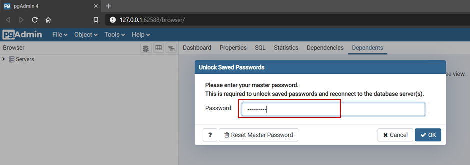

.. meta::
   :theme-color: #3eaf7c
   
.. _cha_dbbereitstellung:

Datenbankbereitstellung
***********************
Diese Anleitung setzt eine vollständige Installation aller Programme und 
Programmkomponenten voraus. Siehe hierzu die Anleitung :ref:`cha_installation`.

|

.. _sec_verpgadmin:

Verwaltung mit pgAdmin
=======================

Starten Sie das Programm **pgAdmin 4** aus dem Startmenü oder der Windows-Suchleiste.

.. _img_dber1:

|

Das Serververwaltungsprogramm wird im Browser geöffnet. 
Um eine Datenbank anzulegen wird das Passwort des Serveradministrator-Benutzerprofils 
(postgres) benötigt. Das Passwort haben Sie bei der Installation festgelegt. 
(Siehe `Installation Abbildung_23 <installation.html#img-inst23>`_)

Passwort mit Formulartaste ``OK`` bestätigen.

.. _img_dber2:

.. container:: fleft mw500

   .. image:: _static/png/dber2.png

Klappen Sie die Elemente ``Servers``, ``PostgreSQL 12`` und ``Databases`` auf. 
Bei der Installation wurden zwei Datenbanken angelegt. 
Datenbank ``postgis_30_sample`` ist unsere **PostGIS**-Beispieldatenbank und 
dient uns als Vorlage um weitere **PostGIS**-Datenbanken zu erzeugen.

.. raw:: html
   
   

.. note:: Vorlage-Datenbank muss deaktiviert sein!

   Damit wir die Datenbank als Vorlage verwenden können, 
   muss diese wie in der Abbildung deaktiviert sein. 
   
   Falls die Datenbank aktiv ist kann mittels :kbd:`Rechtsklick` auf den Datenbanknamen 
   das Kontextmenü geöffnet werden. Wählen Sie in diesem Fall im Kontextmenü 
   ``Disconnect database...`` und bestätigen Sie den Dialog.

|

.. _img_dber3:

.. container:: fleft mw700

   .. image:: _static/png/dber3.png

Mit einem :kbd:`Rechtsklick` auf ``Databases`` öffnet sich 
das Kontextmenü und ermöglicht das Anlegen einer neuen Datenbank ``Create -> Database...``. 

.. raw:: html
   
   

.. _img_dber4:

.. container:: fleft mw700

   .. image:: _static/png/dber4.png

Vergeben Sie einen eindeutigen Datenbanknamen und wechseln Sie 
anschließend zur Registerkarte ``Definition``. 

.. raw:: html
   
   

.. _img_dber5:

.. container:: fleft mw700

   .. image:: _static/png/dber5.png

Füllen Sie das Formular wie im nebenstehenden Bild aus. 
Unter ``Template`` muss die **PostGIS**-Vorlage ausgewählt werden, 
da diese die benötigten **PostGIS**-Komponenten enthält.

Eine Datenbank kann nur dann als Vorlage verwendet werde,
wenn diese gerade nicht aktiv ist.

Erstellen Sie die neue Datenbank mit Formulartaste ``Save``. 

.. raw:: html
   
   

.. _img_dber6:

.. container:: fleft mw700

   .. image:: _static/png/dber6.png

Die Datenbank wurde erfolgreich erstellt und kann nun mittels **norGIS ALKIS Import** 
mit einem ALKIS-Datensatz gefüllt werden. Siehe hierzu Anleitung :ref:`cha_dimport`.

.. raw:: html
   
   

.. note:: Datensatzüberlagerung!

   ALKIS-Datenätze die sich auf die gleiche Region beziehen, 
   müssen in separate Datenbanken importiert werden. Ansonsten überlagern sich die Datensätze. 
   
   Legen Sie also für jede neue Version Ihres Datensatzes eine weitere Datenbank an.
