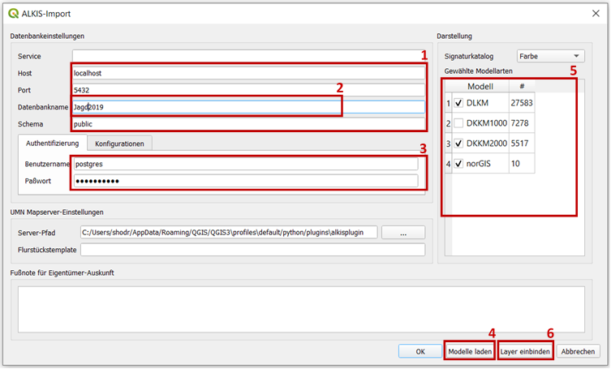
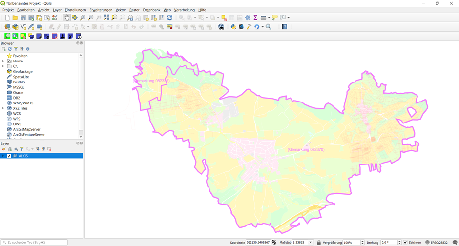

.. meta::
   :theme-color: #3eaf7c

.. _cha_projekterstellung:

Projekterstellung
*****************

Diese Anleitung setzt eine vollständige Installation aller Programme und 
Programmkomponenten, sowie ein als **PostGIS**-Serverdatenbank 
bereitgestellten ALKIS-Datensatz voraus. 
Siehe hierzu die Anleitungen :ref:`cha_installation`, :ref:`cha_dbbereitstellung` und :ref:`cha_dimport`.

|

Starten Sie das Programm **QGIS Desktop** aus dem Startmenü oder der Windows-Suchleiste.

.. _img_pers1:

.. container:: fleft mw500

   .. image:: _static/png/pers1.png

``Neues Projekt`` erstellen 

.. raw:: html
   
   

.. _sec_alkiskonfig:

ALKIS-Konfiguration
===================

.. _img_pers2:

.. container:: fleft mw700

   .. image:: _static/png/pers2.png

``Menüreiter -> Datenbank -> ALKIS -> Konfiguration...`` öffnen.

.. raw:: html
   
   

.. _img_pers3:

|

Konfiguration der Bezugsquelle (Server, Zugangsdaten, Zieldatenbank) 
für den Bezug der ALKIS-Daten und Auswahl der zu beziehenden ALKIS-Modelle.

.. container:: fright mw500

   +-----------------+----------------------------------+
   |    Basis-DLM    |    BasisLandschaftsModell        |
   +=================+==================================+
   |    DFGM         |    Festpunktmodell               |
   +-----------------+----------------------------------+
   |    DGM2         |    DigitalesGelaendemodell2      |
   +-----------------+----------------------------------+
   |    DGM25        |    DigitalesGelaendemodell25     |
   +-----------------+----------------------------------+
   |    DGM5         |    DigitalesGelaendemodell5      |
   +-----------------+----------------------------------+
   |    DGM50        |    Digitales Gelaendemodell50    |
   +-----------------+----------------------------------+
   |    DKKM1000     |    KatasterkartenModell1000      |
   +-----------------+----------------------------------+
   |    DKKM2000     |    KatasterkartenModell2000      |
   +-----------------+----------------------------------+
   |    DKKM500      |    KatasterkartenModell500       |
   +-----------------+----------------------------------+
   |    DKKM5000     |    KatasterkartenModell5000      |
   +-----------------+----------------------------------+
   |    DLKM         |    LiegenschaftskatasterModell   |
   +-----------------+----------------------------------+
   |    DLM1000      |    LandschaftsModell1000         |
   +-----------------+----------------------------------+
   |    DLM250       |    LandschaftsModell250          |
   +-----------------+----------------------------------+
   |    DLM50        |    LandschaftsModell50           |
   +-----------------+----------------------------------+
   |    DTK10        |    TopographischeKarte10         |
   +-----------------+----------------------------------+
   |    DTK100       |    TopographischeKarte100        |
   +-----------------+----------------------------------+
   |    DTK1000      |    TopographischeKarte1000       |
   +-----------------+----------------------------------+
   |    DTK25        |    TopographischeKarte25         |
   +-----------------+----------------------------------+
   |    DTK250       |    TopographischeKarte250        |
   +-----------------+----------------------------------+
   |    DTK50        |    TopographischeKarte50         |
   +-----------------+----------------------------------+

1. Angaben zu Bezugsquelle => Die Angaben können übernommen werden, 
   wenn Sie den PostgreSQL Server entsprechend der Anleitung :ref:`cha_installation` eingerichtet haben.
2. Angabe der Zieldatenbank => Name der Datenbank die in Anleitung :ref:`cha_dbbereitstellung` 
   bereitgestellt und in Anleitung :ref:`cha_dimport` gefüllt wurde.
3. Angaben zur Serverauthentifizierung => 
   Benutzerdaten die während Anleitung :ref:`cha_installation` erstellt wurden.
4. Wenn die Daten der Bezugsquelle korrekt eingetragen wurden, kann mittels Formular-Taste
   ``Modelle laden`` Die Datenbankmodelle geladen werden => Liste ``Gewählte Modellarten`` 
   hat sich aktualisiert.
5. Ihr Datensatz kann verschiedene Modelle enthalten (Siehe nebenstehende Tabelle). 
   Manche Modelle enthalten überschneidende Informationen, wodurch es zu einer mehrfachen 
   überlappenden Darstellung kommt, falls diese Modelle gleichzeitig selektiert sind.

   Die meisten Modelle enthalten zusätzliche Darstellungsobjekte die nicht zwingend benötigt werden, 
   aber die Darstellung sinnvoll erweitern. In unserem Beispiel wird nur das Modell DLKM zwingend 
   benötigt. 
6. Formular-Taste ``Layer einbinden`` betätigen um die aktuell gewählten Modelle 
   dem Projekt hinzuzufügen.

.. raw:: html
   
   

.. _sec_kartendarstellung:

Kartendarstellung
==================

.. _img_pers4:

.. container:: fleft mw500

   .. image:: _static/png/pers4.png

Das Bedienfeld ``Bedienfeld Layer`` sollte nun eine Gruppe ``ALKIS`` beinhalten.

.. raw:: html
   
   

.. _img_pers5:

.. container:: fleft mw500

   .. image:: _static/png/pers5.png

Darstellung der Gruppe => Haken setzen

.. raw:: html
   
   

.. _img_pers6:

.. container:: fleft mw700

   .. image:: _static/png/pers6.png

Auf ``ALKIS``-Gruppe :kbd:`Rechtsklick` um Kontextmenü zu öffnen.
``Zur Gruppe zoomen`` auswählen

.. raw:: html
   
   

Das Projektfenster sollte nun Ihren Datensatz darstellen. 
Die Kartendarstellung kann, unabhängig von dem aktuellen Werkzeug, 
bei :kbd:`gehaltenen Mausrad` verschoben werden. :kbd:`Drehen am Mausrad`
verändert den Kartenzoom.

Sie können nun die QGIS-Standardfunktionen oder die in 
Anleitung :ref:`cha_funkuebersicht` vorgestellten Funktionen auf den Datensatz anwenden.

.. _img_pers7:

