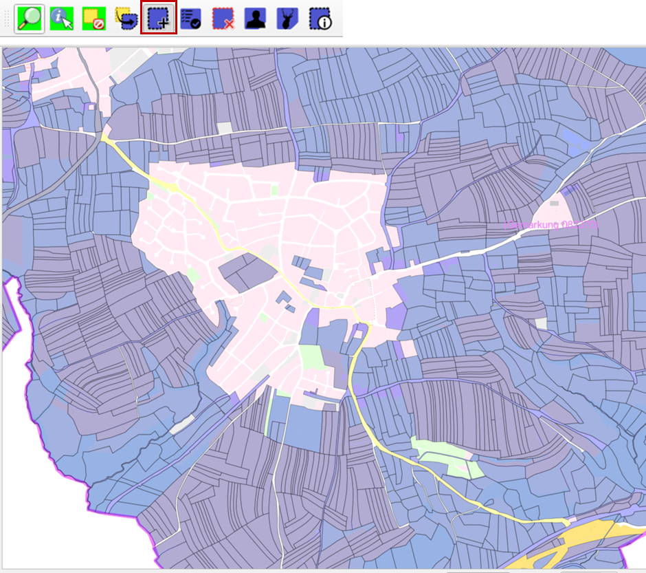
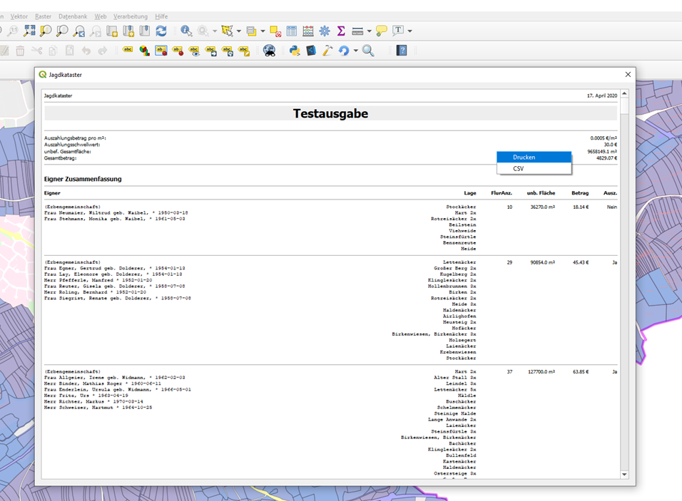

.. meta::
   :theme-color: #3eaf7c

.. _cha_jagdkataster:

Jagdkataster Erstellung
***********************

Diese Anleitung setzt eine vollständige Installation aller Programme und 
Programmkomponenten, sowie ein geladenes und aktives QGIS-ALKIS-Projekt 
voraus. Siehe hierzu die Anleitungen :ref:`cha_installation`,
:ref:`cha_dbbereitstellung`, :ref:`cha_dimport`, und :ref:`cha_projekterstellung`.

In diesem Beispiel erstellen wir ein Jagdkataster für die 
Gemarkung 082370 des BW-Testdatensatzes. 
Dabei werden wir nur Flurstücke mit einer unbefriedeten Nutzung verwenden.
Flurstücke bei denen eine Jagdausübung aufgrund von Umgebungsbedingungen 
nicht möglich sind, oder der Eigentümer einer Jagdausübung widersprochen 
hat, werden beispielhaft ausgeschlossen. 

Alle in den Abbildungen gezeigten Flächen und Eigentümer entstammen dem 
BW-Testdatensatz.

.. _sec_fsauswahl:

Flurstücksauswahl
=================

Wir starten mit einem geöffneten und geladenen Projekt.

.. _img_jagd1:

.. container:: fleft mw500

   .. image:: _static/png/jagd1.png

Symbol ``Selektierung nach Flurstückeigenschaften`` anwählen 
um schnellstmöglich alle Flurstücke von Interesse zu selektieren.

.. raw:: html
   
   

.. _img_jagd2:

.. image:: _static/png/jagd2.png

Es wurde die Gemarkungsnummer und alle unbefriedeten Nutzungen, wie etwa Gehölz, 
Wald, Unland und Landwirtschaft-Grünland gewählt. 
Innerhalb einer Formular-Liste kann die Tastenkombination :kbd:`Strg + a` und die Formulartaste 
``Anwählen`` genutzt werden um alle Listenelemente anzuwählen.

Bestätigen Sie das Formular mit Formulartaste ``OK``.

Es wurden nun alle Flurstücke der gewählten Gemarkung selektiert, 
die eine der gewählten Nutzungen enthalten. Auch dann, wenn diese Nutzung weniger als 1 m² beträgt 
und nicht die Hauptnutzung ist.

In unserem Beispiel gibt es landwirtschaftliche Flächen im Ortskern. 
Diese können mit dem Einzel-Selektierungswerkzeug, durch Anklicken bei aktivem Werkzeug, 
deselektiert werden. Das Werkzeug eignet sich auch, um Flächen von Eigentümern zu entfernen 
die einer Jagdausübung widersprochen haben, oder bei denen eine Jagdausübung aufgrund 
einer Einzäunung nicht möglich ist.

.. tip:: Navigation mit Werkzeug

   Während das Werkzeug aktiv ist, kann die Karte bei :kbd:`gedrücktem Mausrad` verschoben werden.

|

.. _img_jagd3:

|

.. _sec_jkausfuehren:

Kataster ausgeben
=================

Durch wählen der ``Jagdkataster erstellen``-Funktion wird die Erstellung des Jagdkatasters gestartet.
In diesem Beispiel muss für eine Auszahlung des Eigentümers ein Betrag von 30€ überschritten werden. 
Der Quadratmeterpreis für eine unbefriedete Fläche ist mit 0.0005€ angegeben, was 5€ pro Hektar 
entspricht.

Viele der selektierten Flurstücke enthalten Nutzungen die nicht in der Jagdkataster Berechnung 
berücksichtigt werden dürfen. Setzen Sie einen Haken bei den Nutzungen die NICHT berücksichtigt 
werden sollen.

.. note:: 

   Im gezeigten Beispiel wurde die Tastenkombination :kbd:`Strg + a` und die Formulartaste ``Anwählen``
   verwendet um zuerst alle Nutzungen auszuschließen.

|

Bestätigen Sie das Formular mit Formulartaste ``OK``. Das Jagdkataster wird erstellt. 
Die Berechnung kann einige Sekunden benötigen.

Gibt es Unstimmigkeiten bei den Grundbuchangaben wird ein Dialog angezeigt mit dem die 
betroffenen Flurstücksnachweise eingesehen werden können. Das ist zum Beispiel der Fall, 
wenn ein Grundstück keinen Eigentümer besitzt oder die Summer der Anteile nicht 1 entspricht.  

.. _img_jagd4:

.. image:: _static/png/jagd4.png

|

Bei abgeschlossener Berechnung wird das Jagdkataster in einem neuen Fenster angezeigt. 
Ein :kbd:`Rechtsklick` auf dieses Fenster öffnet das Kontextmenü mit dem das Kataster 
gedruckt oder als CSV-Datei gespeichert werden kann. 
CSV-Dateien können mit Microsoft Excel geöffnet und bearbeitet werden.

Häufig besitzen Grundbücher Doppelnennungen für eine einzelne Person, einmal mit und 
ohne Geburtsdatum oder mit und ohne Zweitnamen. Prüfen Sie Liste der Eigentümer sorgfältig. 
Nur selten handelt es sich dabei wirklich um Vater und Sohn oder Mutter und Tochter mit dem 
gleichen Namen.

.. note:: 

   Der angegebene Gesamtbetrag entspricht dem Gesamtwert aller unbefriedeten Flächen. 
   Unabhängig davon ob der Auszahlungsschwellwert überschritten wurde. 

.. _img_jagd5:

|

Fall Sie sich für die Erstellung dieses Programmes und Anleitungen erkenntlich zeigen 
wollen, können Sie mir gerne eine Spende in Form einer Schenkung zukommen lassen. 
Weitere Informationen finden Sie hier `Spenden/Schenkung <https://jagdkataster.org/spenden>`_.

|

Es kann keine Gewährleistung übernommen werden, dass das Jagdkataster nach Ihren Kriterien
fehlerfrei erstellt wird. Am besten überprüfen Sie das Ergebnis anhand von Flurstücken 
die Ihnen persönlich bekannt sind. Nutzen Sie die Eigentümersuche unter |fico2| und die 
Übertragungsfunktion |fico5| um die Flurstücke für einen spezifischen Eigentümer zu 
selektieren.

.. |fico2| image:: _static/png/fico2.png
            :width: 1em
.. |fico5| image:: _static/png/fico5.png
            :width: 1em

